# bizMOB4Vue-SI Architecture Guide

Vue 3 + Ionic 기반 하이브리드 모바일 애플리케이션의 아키텍처 문서입니다.

## 📋 목차

- [전체 아키텍처](#-전체-아키텍처)
- [기술 스택](#-기술-스택)
- [폴더 구조](#-폴더-구조)
- [데이터 플로우](#-데이터-플로우)
- [핵심 컴포넌트](#-핵심-컴포넌트)
- [보안 아키텍처](#-보안-아키텍처)
- [배포 아키텍처](#-배포-아키텍처)

## 🏗️ 전체 아키텍처
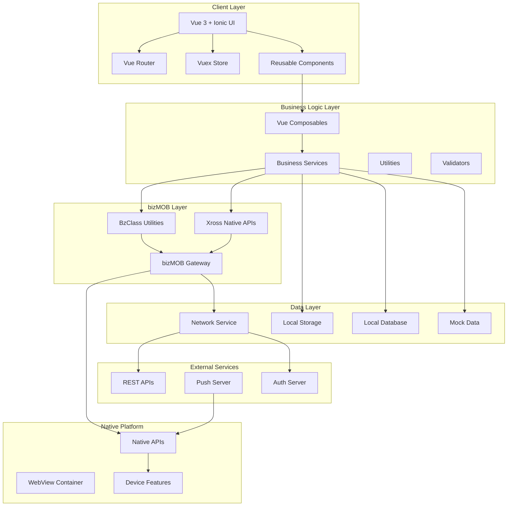

### 레이어별 설명

#### 1. Client Layer (프레젠테이션 계층)
- **Vue 3 + Ionic UI**: 사용자 인터페이스
- **Vue Router**: 페이지 라우팅 및 네비게이션
- **Vuex Store**: 전역 상태 관리
- **Components**: 재사용 가능한 UI 컴포넌트

#### 2. Business Logic Layer (비즈니스 로직 계층)
- **Composables**: Vue 3 Composition API 기반 로직 재사용
- **Services**: 비즈니스 로직 및 데이터 처리
- **Utils**: 공통 유틸리티 함수
- **Validators**: 데이터 검증 로직

#### 3. bizMOB Layer (플랫폼 계층)
- **BzClass**: 인증, 암호화, 다국어 처리 유틸리티
- **Xross**: 네이티브 API 접근 래퍼
- **Gateway**: JavaScript와 네이티브 간 브리지

#### 4. Data Layer (데이터 계층)
- **Network**: 서버 통신 관리
- **Storage**: 로컬 저장소 관리
- **Database**: SQLite 데이터베이스 관리
- **Mock**: 개발용 Mock 데이터

## 🛠️ 기술 스택

### Core Framework
```
Vue.js 3.5.13          # 프론트엔드 프레임워크
Ionic Vue 8.5.6        # 모바일 UI 프레임워크
TypeScript 5.4.5       # 타입 안전성
```

### State Management & Routing
```
Vuex 4.1.0                    # 상태 관리
Vue Router 4.5.1              # 라우팅
vuex-persistedstate 4.1.0     # 상태 영속화
```

### Build & Development
```
Vue CLI 5.0.8                 # 빌드 도구
Webpack (Vue CLI 포함)        # 모듈 번들러
Babel (Vue CLI 포함)          # JavaScript 트랜스파일러
ESLint 8.57.0                # 코드 품질 검사
```

### UI & Styling
```
Ionic Components              # 모바일 UI 컴포넌트
SCSS/Sass 1.77.2             # CSS 전처리기
Ionic CSS Variables           # 테마 시스템
```

### Utilities & Libraries
```
crypto-js 4.2.0               # 암호화
moment 2.30.1                 # 날짜/시간 처리
dompurify 3.1.5               # XSS 보안
url-safe-base64 1.3.0         # Base64 인코딩
```

### bizMOB Platform
```
bizMOB-xross4.js              # 네이티브 브리지
bizMOB-core.js                # 코어 라이브러리
bizMOB-core-web.js            # 웹 확장
bizMOB-locale.js              # 다국어 지원
bizMOB-polyfill.js            # 호환성 폴리필
```

### Development & Testing
```
Cross-env 7.0.3               # 환경 변수 관리
Rimraf 5.0.7                  # 파일 정리
Vue i18n 9.13.1               # 국제화
```

## 📁 폴더 구조

```
bizMOB4Vue-SI/
├── public/                           # 정적 파일
│   ├── bizMOB/                      # bizMOB 플랫폼 라이브러리
│   │   ├── app.config               # 앱 설정 파일
│   │   ├── bizMOB-core.js          # 코어 라이브러리
│   │   ├── bizMOB-core-web.js      # 웹 확장
│   │   ├── bizMOB-locale.js        # 다국어 지원
│   │   ├── bizMOB-polyfill.js      # 폴리필
│   │   └── bizMOB-xross4.js        # 네이티브 브리지
│   ├── extlib/                     # 외부 라이브러리
│   │   ├── crypto-js.min.js        # 암호화 라이브러리
│   │   └── forge.min.js            # RSA 암호화
│   ├── fonts/                      # 폰트 파일
│   ├── mock/                       # Mock 데이터
│   │   ├── DM0001.json            # 로그인 Mock
│   │   ├── DM0002.json            # 게시판 Mock
│   │   └── bizMOB/                # Native API Mock
│   │       ├── App/, File/, Push/, System/ 등
│   ├── favicon.ico
│   └── index.html                  # 메인 HTML
│
├── src/                            # 소스 코드
│   ├── App.vue                     # 루트 컴포넌트
│   ├── main.ts                     # 애플리케이션 엔트리
│   │
│   ├── assets/                     # 정적 리소스
│   │   ├── css/
│   │   │   └── global.scss         # 전역 스타일
│   │   └── images/                 # 이미지 파일
│   │
│   ├── components/                 # 재사용 컴포넌트
│   │   ├── index.ts               # 컴포넌트 내보내기
│   │   ├── AppHeader.vue          # 헤더 컴포넌트
│   │   ├── AppLoading.vue         # 로딩 컴포넌트
│   │   ├── AppMenu.vue            # 메뉴 컴포넌트
│   │   ├── AppScrollLoading.vue   # 무한스크롤 로딩
│   │   └── elements/              # 기본 UI 요소
│   │       ├── AppInput.vue       # 입력 컴포넌트
│   │       └── AppSelect.vue      # 선택 컴포넌트
│   │
│   ├── views/                      # 페이지 컴포넌트
│   │   ├── LOGIN/                 # 로그인 관련
│   │   │   └── LOGIN0100.vue      # 로그인 페이지
│   │   ├── MAIN/                  # 메인 화면
│   │   │   ├── MAIN0100.vue       # 메인 대시보드
│   │   │   └── MAIN0200.vue       # 샌드박스
│   │   ├── BOARD/                 # 게시판 관련
│   │   │   ├── BOARD0100.vue      # 게시판 목록
│   │   │   ├── BOARD0101.vue      # 필터
│   │   │   ├── BOARD0200.vue      # 작성
│   │   │   ├── BOARD0201.vue      # 상세
│   │   │   └── BOARD0300.vue      # 뷰어
│   │   ├── MENU/                  # 메뉴 관련
│   │   │   └── MENU0100.vue       # 사이드 메뉴
│   │   └── README/                # 가이드 화면
│   │       ├── README01.vue       # API 예제
│   │       ├── README02.vue       # 라우팅 예제
│   │       └── README03_modal.vue # 모달 예제
│   │
│   ├── router/                     # 라우팅 설정
│   │   ├── index.ts               # 라우터 메인
│   │   └── routes/                # 라우트 정의
│   │       ├── board.ts           # 게시판 라우트
│   │       ├── login.ts           # 로그인 라우트
│   │       ├── main.ts            # 메인 라우트
│   │       └── readme.ts          # 가이드 라우트
│   │
│   ├── store/                      # 상태 관리
│   │   ├── index.ts               # 스토어 메인
│   │   ├── plugins.ts             # 스토어 플러그인
│   │   └── modules/               # 모듈별 스토어
│   │       ├── app.ts             # 앱 상태
│   │       ├── login.ts           # 로그인 상태
│   │       └── user.ts            # 사용자 상태
│   │
│   ├── bizMOB/                     # bizMOB 클라이언트
│   │   ├── BzClass/               # 유틸리티 클래스
│   │   │   ├── BzCrypto.ts        # 암호화 관리
│   │   │   ├── BzLocale.ts        # 다국어 관리
│   │   │   └── BzToken.ts         # JWT 토큰 관리
│   │   ├── Xross/                 # Native API 래퍼
│   │   │   ├── index.ts           # API 내보내기
│   │   │   ├── App.ts             # 앱 제어
│   │   │   ├── Config.ts          # 설정 관리
│   │   │   ├── Contacts.ts        # 연락처
│   │   │   ├── Database.ts        # 데이터베이스
│   │   │   ├── Device.ts          # 디바이스 정보
│   │   │   ├── Event.ts           # 이벤트 처리
│   │   │   ├── File.ts            # 파일 관리
│   │   │   ├── Localization.ts    # 로케일
│   │   │   ├── Logger.ts          # 로깅
│   │   │   ├── Network.ts         # 네트워크 통신
│   │   │   ├── Properties.ts      # 속성 관리
│   │   │   ├── Push.ts            # 푸시 알림
│   │   │   ├── Storage.ts         # 저장소
│   │   │   ├── System.ts          # 시스템 기능
│   │   │   └── Window.ts          # UI 컴포넌트
│   │   └── i18n/                  # 국제화
│   │       └── index.ts           # i18n 설정
│   │
│   ├── shared/                     # 공통 유틸리티
│   │   ├── index.ts               # 내보내기
│   │   ├── constants.ts           # 상수
│   │   ├── utils.ts               # 유틸리티 함수
│   │   ├── validators.ts          # 검증 함수
│   │   ├── composables/           # Composable 함수
│   │   │   ├── useDate.ts         # 날짜 처리
│   │   │   ├── useMessage.ts      # 메시지/알림
│   │   │   ├── useModal.ts        # 모달 관리
│   │   │   ├── useNative.ts       # 네이티브 기능
│   │   │   ├── useNavigate.ts     # 네비게이션
│   │   │   └── useNetwork.ts      # 네트워크 처리
│   │   └── services/              # 비즈니스 서비스
│   │       └── StoreService.ts    # 스토어 서비스
│   │
│   ├── layouts/                    # 레이아웃 컴포넌트
│   │   └── PageLayout.vue         # 기본 페이지 레이아웃
│   │
│   ├── locales/                    # 다국어 파일
│   │   ├── en.json                # 영어
│   │   ├── ko.json                # 한국어
│   │   └── README.md              # 다국어 가이드
│   │
│   ├── component.d.ts             # 컴포넌트 타입 정의
│   ├── shims-vue.d.ts            # Vue 타입 정의
│   └── types.d.ts                # 전역 타입 정의
│
├── dist/                          # 빌드 결과물
├── node_modules/                  # 의존성 패키지
├── .env*                         # 환경 변수 파일
├── babel.config.js               # Babel 설정
├── package.json                  # 프로젝트 설정
├── tsconfig.json                 # TypeScript 설정
├── vue.config.js                 # Vue CLI 설정
├── README.md                     # 프로젝트 문서
├── bizMOB-Client-Guide.md        # bizMOB 클라이언트 가이드
├── bizMOB-Client-Practice.md     # 실무 활용 가이드
└── ARCHITECTURE.md               # 아키텍처 문서 (이 파일)
```

### 폴더별 역할

| 폴더 | 역할 | 설명 |
|------|------|------|
| `public/` | 정적 리소스 | HTML, 폰트, 외부 라이브러리, Mock 데이터 |
| `src/components/` | UI 컴포넌트 | 재사용 가능한 Vue 컴포넌트 |
| `src/views/` | 페이지 컴포넌트 | 라우터로 접근하는 페이지 컴포넌트 |
| `src/router/` | 라우팅 | Vue Router 설정 및 라우트 정의 |
| `src/store/` | 상태 관리 | Vuex 스토어 및 모듈 |
| `src/bizMOB/` | 플랫폼 API | bizMOB 네이티브 기능 접근 |
| `src/shared/` | 공통 로직 | Composable, 서비스, 유틸리티 |
| `src/locales/` | 다국어 | i18n 번역 파일 |

## 🔄 데이터 플로우

### 1. 일반적인 API 호출 플로우

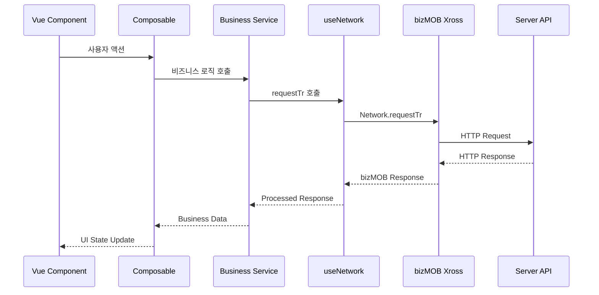

### 2. 인증 및 토큰 관리 플로우

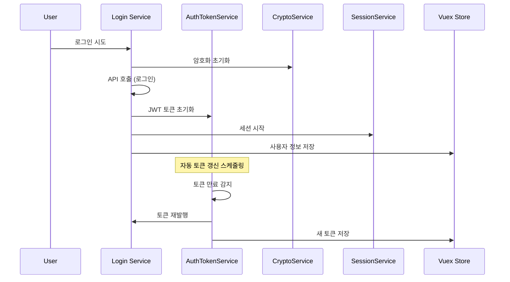

### 3. 에러 처리 플로우

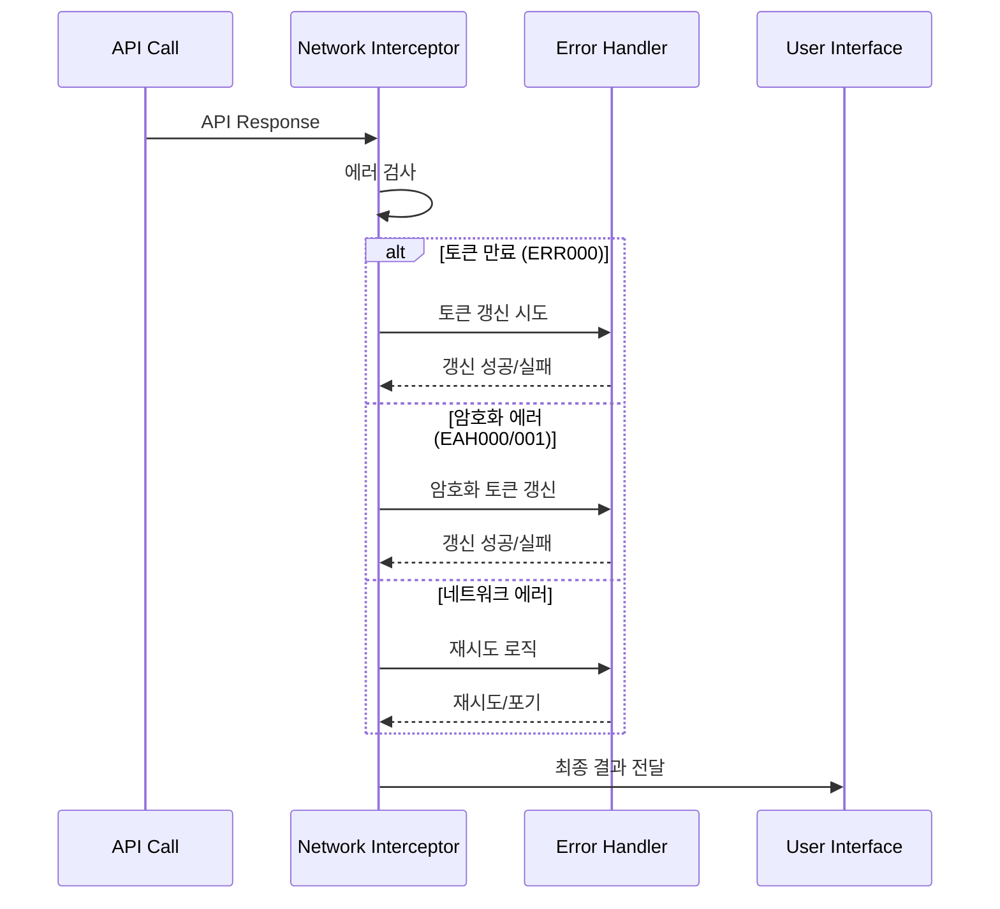

### 4. Mock 데이터 플로우

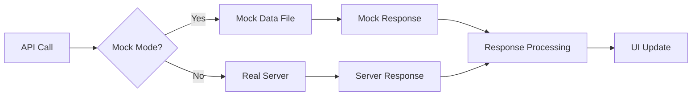

### 5. 상태 관리 플로우

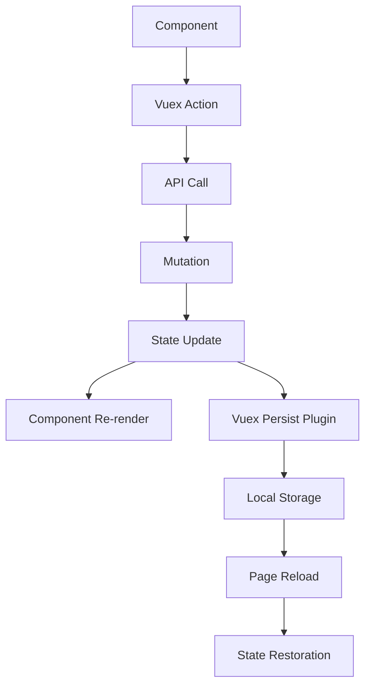

## 🔧 핵심 컴포넌트

### 1. bizMOB Gateway
```javascript
// bizMOB 네이티브와 JavaScript 간 브리지
bizMOB.gateway(className, method, requiredParams, params)
```

### 2. Network Service (useNetwork)
```typescript
// 통합 네트워크 관리
const { requestTr, requestLogin } = useNetwork();
```

### 3. State Management (Vuex)
```typescript
// 전역 상태 관리
const store = new StoreService('moduleName');
```

### 4. Authentication Services
```typescript
// JWT 토큰 관리
const authService = AuthTokenService.getInstance();
// 암호화 통신 관리  
const cryptoService = CryptoService.getInstance();
// 세션 관리
const sessionService = SessionService.getInstance();
```

## 🔐 보안 아키텍처

### 보안 계층 구조

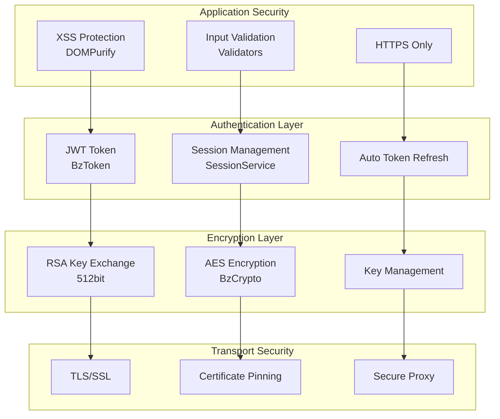

### 보안 기능

1. **인증 보안**
   - JWT 토큰 기반 인증
   - 자동 토큰 갱신
   - 세션 타임아웃 관리

2. **암호화 통신**
   - RSA 키 교환 (512bit)
   - AES 대칭키 암호화
   - 암호화 토큰 자동 갱신

3. **애플리케이션 보안**
   - XSS 방지 (DOMPurify)
   - 입력 데이터 검증
   - HTTPS 강제 사용

## 📦 배포 아키텍처

### 환경별 배포 구조

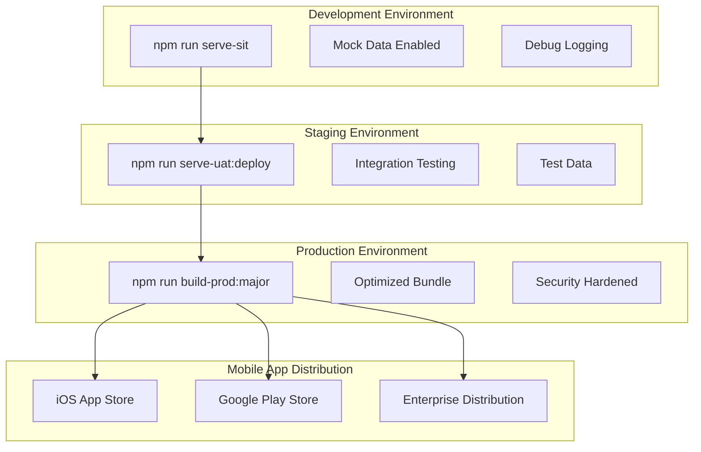

### 빌드 옵션

| 환경 | 명령어 | NODE_ENV | 기능 |
|------|--------|----------|------|
| Development | `serve-sit` | development | Mock 데이터, 디버깅 |
| Staging | `serve-uat:deploy` | production | 성능 최적화, 테스트 |
| Production | `build-prod:major` | production | 최적화, 보안 강화 |

### 파일 구조 (빌드 결과)

```
dist/
├── production/           # 운영 빌드
│   ├── contents/        # 앱 컨텐츠
│   │   ├── css/        # 스타일시트
│   │   ├── js/         # JavaScript 번들
│   │   ├── fonts/      # 폰트 (major 빌드만)
│   │   └── img/        # 이미지
│   └── index.html      # 메인 HTML
├── staging/             # 스테이징 빌드
└── development/         # 개발 빌드
```

## 🔍 성능 최적화

### 번들 최적화

1. **Code Splitting**
   - 라우터 기반 청크 분할
   - 동적 import 사용

2. **Tree Shaking**
   - 사용하지 않는 코드 제거
   - ES6 모듈 시스템 활용

3. **Asset Optimization**
   - 이미지 최적화
   - 폰트 서브셋팅

### 런타임 최적화

1. **Caching Strategy**
   - Service Worker 캐싱
   - 브라우저 캐시 활용

2. **Network Optimization**
   - HTTP/2 사용
   - 압축 전송 (gzip/brotli)

3. **Rendering Optimization**
   - Virtual Scrolling
   - Lazy Loading

## 📊 모니터링 및 로깅

### 로깅 시스템

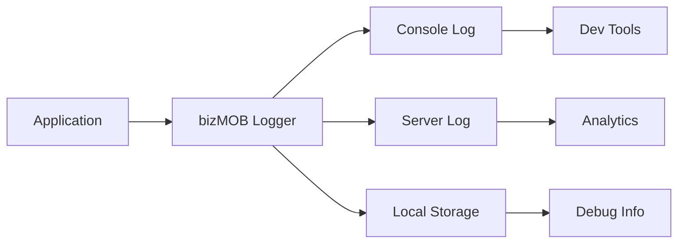

### 에러 추적

1. **Client-side Logging**
   - bizMOB Logger 사용
   - 개발 환경 상세 로그

2. **Error Reporting**
   - 중요 에러 서버 전송
   - 사용자 피드백 수집

3. **Performance Monitoring**
   - 페이지 로딩 시간
   - API 응답 시간
   - 메모리 사용량

## 🔄 개발 워크플로우

### 개발 프로세스

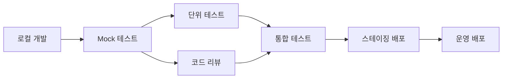

### 품질 관리

1. **Code Quality**
   - ESLint 규칙 준수
   - TypeScript 타입 검사
   - 코드 리뷰

2. **Testing Strategy**
   - Mock 데이터 테스트
   - 시나리오 기반 테스트
   - 에러 상황 테스트

3. **Documentation**
   - API 문서 작성
   - 아키텍처 문서 관리
   - 사용자 가이드 제공

이 아키텍처 문서는 bizMOB4Vue-SI 프로젝트의 전체적인 구조와 동작 방식을 이해하는 데 도움이 되며, 새로운 개발자의 온보딩과 시스템 확장 시 가이드라인으로 활용할 수 있습니다.