# bizMOB MCP Ecosystem 완전 가이드

## 📋 목차

1. [생태계 개요](#1-생태계-개요)
2. [아키텍처 구조](#2-아키텍처-구조)
3. [생태계 구성 요소](#3-생태계-구성-요소)
4. [데이터 흐름 및 상호작용](#4-데이터-흐름-및-상호작용)
5. [개발 생명주기 통합](#5-개발-생명주기-통합)
6. [생태계 특성 및 가치](#6-생태계-특성-및-가치)
7. [성숙도 및 진화 단계](#7-성숙도-및-진화-단계)
8. [구현 로드맵](#8-구현-로드맵)

---

## 1. 생태계 개요

### 🌍 bizMOB MCP Ecosystem이란?

bizMOB MCP (Model Context Protocol) Ecosystem은 AI 시대의 **Multiexperience Development Platform**으로, 개발 생명주기 전반에 걸쳐 AI를 통합한 **자가 진화하는 개발 생태계**입니다.

### 🎯 핵심 비전

> **"AI와 개발자가 공생하며, 사용할수록 더 똑똑해지는 살아있는 개발 환경"**

### 📊 생태계 전체 구조

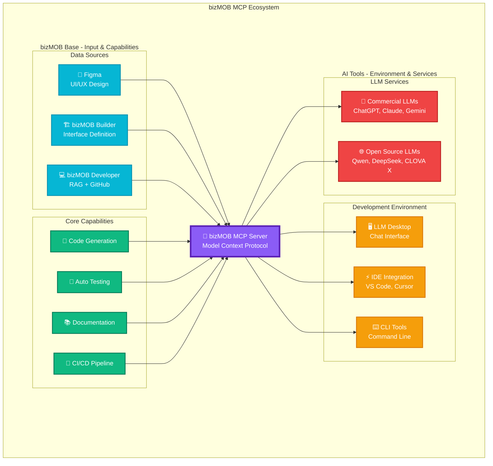

---

## 2. 아키텍처 구조

### 🏗️ 계층별 아키텍처

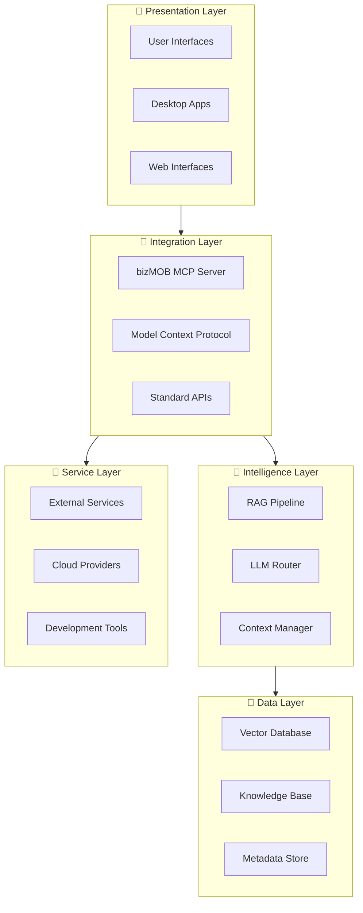

### 🔄 MCP Server 중심 허브 구조

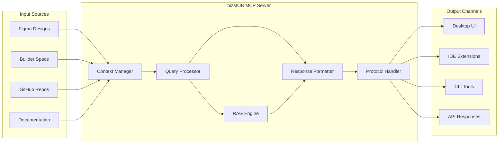

---

## 3. 생태계 구성 요소

### 📊 구성 요소별 역할 매트릭스

| 구성 요소 | 역할 | 입력 | 출력 | AI 활용도 |
|-----------|------|------|------|-----------|
| **Figma** | 🎨 디자인 생산자 | UI/UX 요구사항 | 디자인 스펙, 컴포넌트 | ⭐⭐⭐ |
| **bizMOB Builder** | 🏗️ 구조 설계자 | 비즈니스 로직 | 인터페이스 정의 | ⭐⭐⭐⭐ |
| **bizMOB Developer** | 💻 지식 관리자 | 문서, 코드 | RAG 데이터, 예제 | ⭐⭐⭐⭐⭐ |
| **MCP Server** | 🧠 중앙 조율자 | 모든 소스 | 통합 컨텍스트 | ⭐⭐⭐⭐⭐ |
| **LLM Services** | 🤖 지능 제공자 | 쿼리, 컨텍스트 | AI 응답, 코드 | ⭐⭐⭐⭐⭐ |
| **Development Tools** | 🛠️ 실행 환경 | AI 응답 | 구현된 솔루션 | ⭐⭐⭐⭐ |

### 🎨 Data Sources 상세

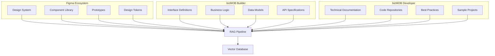

### 🤖 LLM Services 생태계

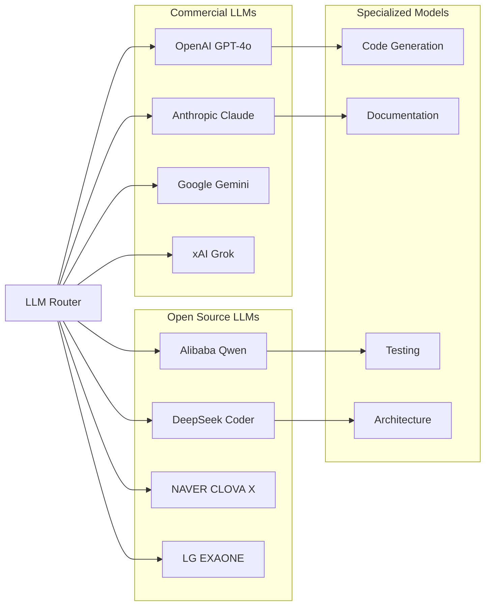

---

## 4. 데이터 흐름 및 상호작용

### 🔄 순환적 가치 창출 프로세스

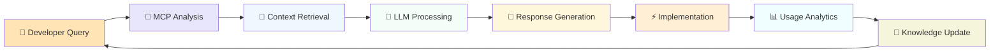

### 📡 실시간 상호작용 시퀀스

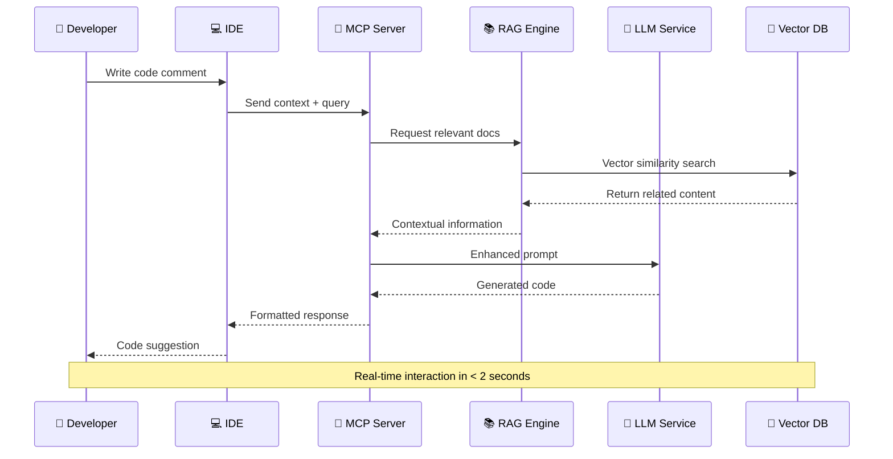

### 🌊 다중 소스 데이터 융합

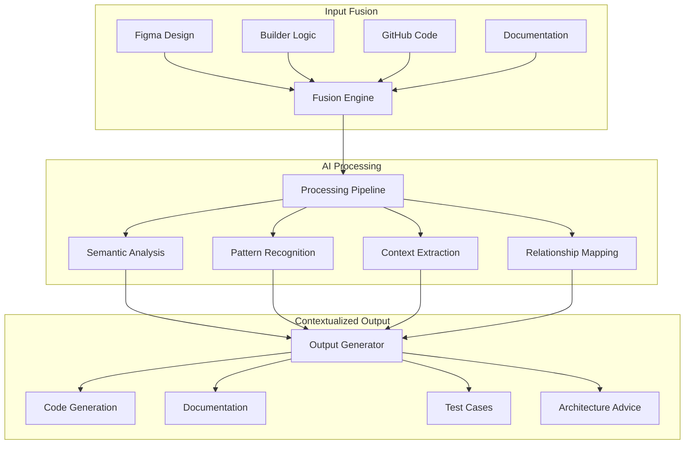

---

## 5. 개발 생명주기 통합

### 🔄 SDLC 전체 통합 프로세스

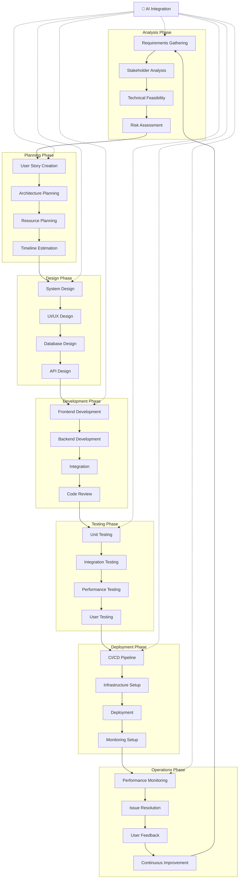

### ⚡ AI 도구별 활용 매핑

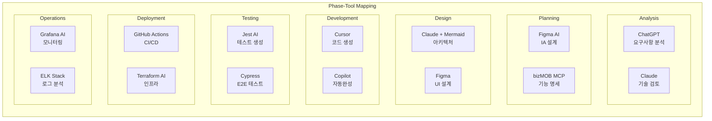

---

## 6. 생태계 특성 및 가치

### 🌱 자가 진화 메커니즘

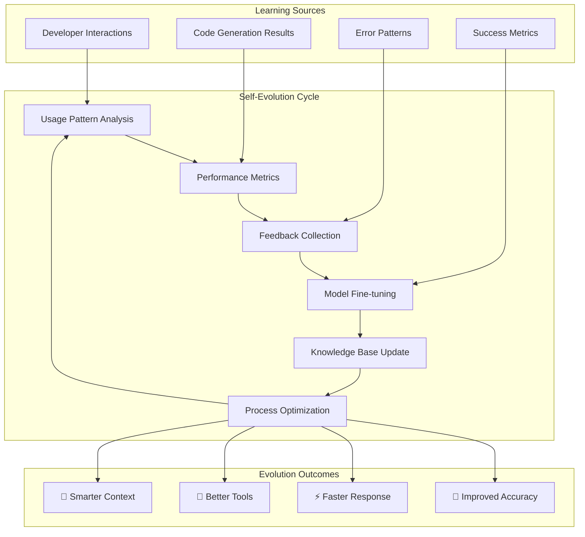

### 🤝 상호 이익적 관계 (Symbiotic Relationships)

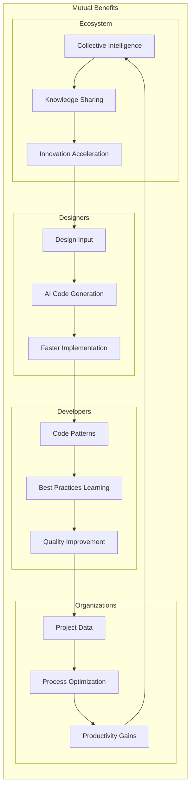

### 📈 가치 창출 네트워크

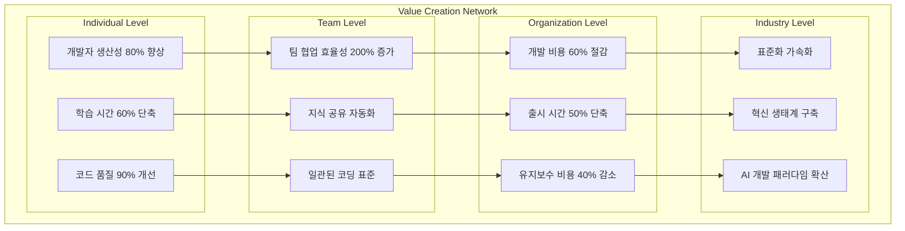

---

## 7. 성숙도 및 진화 단계

### 📊 생태계 성숙도 레벨

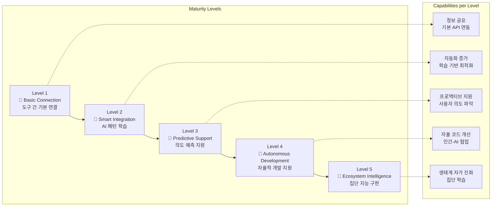

### 🎯 성과 지표 진화

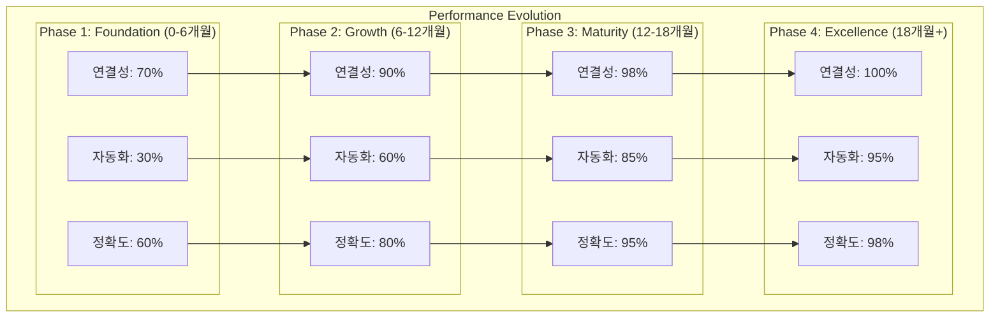

---

## 8. 구현 로드맵

### 🗓️ 단계별 구현 계획

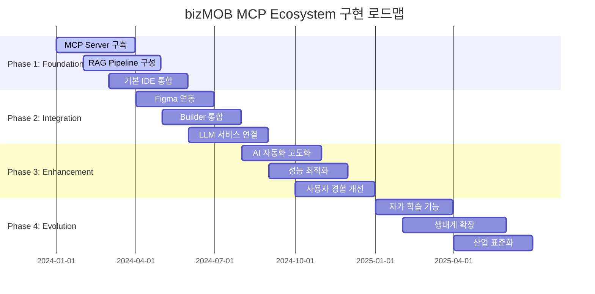

### 🎯 우선순위 매트릭스

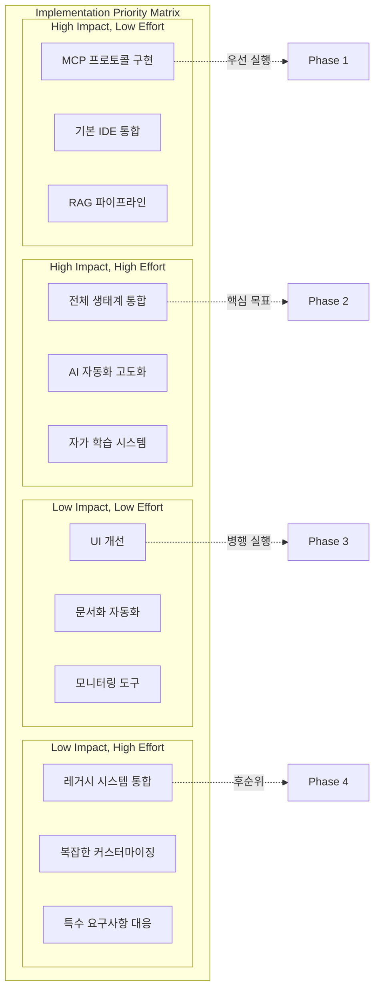

### 🚀 성공 요소 및 위험 관리

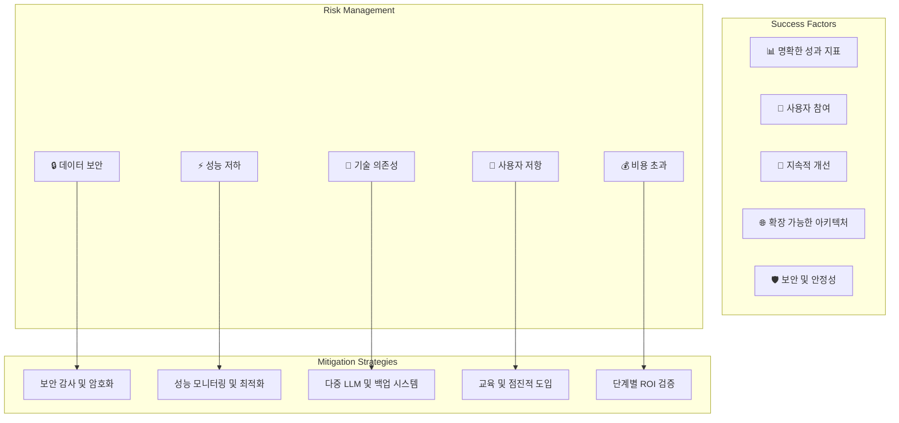

---

## 📊 핵심 성과 지표 (KPI)

### 🎯 정량적 지표

| 카테고리 | 지표 | 현재 | 목표 | 측정 방법 |
|----------|------|------|------|-----------|
| **생산성** | 개발 시간 단축 | - | 80% | 기능당 개발 시간 |
| **품질** | 버그 감소율 | - | 70% | 배포 후 버그 수 |
| **효율성** | 코드 재사용률 | 30% | 80% | 재사용 컴포넌트 비율 |
| **자동화** | 수동 작업 감소 | - | 85% | 자동화된 태스크 비율 |
| **만족도** | 개발자 NPS | - | 80+ | 정기 설문 조사 |

### 🔄 정성적 지표

| 영역 | 현재 상태 | 목표 상태 | 측정 방법 |
|------|-----------|-----------|-----------|
| **학습 곡선** | 개별 도구별 학습 | 통합 플랫폼 학습 | 온보딩 시간 측정 |
| **협업 품질** | 사일로 현상 | 원활한 정보 공유 | 팀 간 커뮤니케이션 빈도 |
| **혁신 속도** | 점진적 개선 | 지속적 혁신 | 새로운 기능 도입 주기 |
| **기술 부채** | 누적 증가 | 자동 관리 | 코드 품질 스코어 |